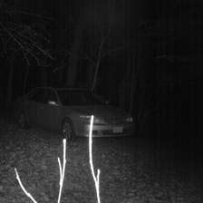
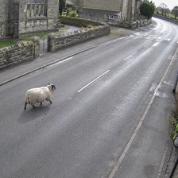
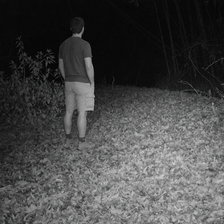

# Security Classifier

Still image classifier for security and CCTV frames. Detects whether the focus of an image is either a person, an animal, a vehicle or an empty scene and reports back with a confidence score.

[security-classifier.onrender.com](https://security-classifier.onrender.com/)

## Contents
- [How to Run](#how-to-run)
- [Dataset & Data Collection](#dataset--data-collection)
- [Data Processing](#data-processing)
- [Augmentation Strategy](#augmentation-strategy)
- [Model Architecture](#model-architecture)
- [Training Configuration](#training-configuration)
- [Results](#results)
- [Stress Testing](#stress-testing)
- [Deployment](#deployment)
- [Technologies Used](#technologies-used)
- [Evaluation](#evaluation)
- [Further Improvements in Order](#further-improvements-in-order)

## How to Run

**Try it live:** [security-classifier.onrender.com](https://security-classifier.onrender.com/) 

**Run it locally:**

1. Clone the repo
   ```
   git clone https://github.com/oscar-swan/security-classifier.git
   cd security-classifier
   ```

2. Install dependencies
   ```
   pip install -r requirements.txt
   ```

3. Run the web app
   ```
   python app.py
   ```

**To retrain the model from scratch:**

1. Prepare the dataset (center crops and resizes raw images to 224×224)
   ```
   python src/data_prep.py
   ```
2. Train
   ```
   python src/train.py
   ```
   All hyperparameters live in `config.py` 

3. Evaluate
   ```
   python src/evaluate.py
   ```
   Outputs precision, recall, F1 and a confusion matrix on the test set.

## Dataset & Data Collection

I used Kaggle to search for datasets that would fit this project. I found a human detection dataset (constantinwerner/human-detection-dataset) which had CCTV style images containing humans and others without, which I planned to use for the human and nothing categories. I then found a vehicle type dataset (sujaykapadnis/vehicle-type-image-dataset) with CCTV style vehicle only images, but had to exclude motorcycle images that included humans as this is conflicting for the model and I would like it to identify a human over a vehicle as identifying a human is arguably the most important class to identify in a security context.

Since many of these vehicle shots were close-ups I added some variation with the inclusion of nadinpethiyagoda's vehicle dataset for YOLO, marquis03's vehicle-classification dataset and saumyapatel's traffic-vehicles-object-detection dataset. I then went through the nothing and human images to remove any that contained vehicles, using a rule that if a vehicle takes up 30% or more of the image and is the main focus, it counts as a vehicle. This was to stop parked cars in the background triggering a vehicle classification.

For animals, I originally used a mix of several datasets including (asaniczka's 45-animal mammals dataset, iamsouravbanerjee's 90-animal dataset, and snmahsa's cats/dogs/foxes dataset) but after gathering a collection of images of several different UK species I determined these images would not suffice. Most of these were professional, up close, high quality photographs with background blur which is not consistent with CCTV footage, so I had to locate a new source.

Eventually I found the LILA BC ENA24-detection dataset which contained 10,000 images of animals captured in camera traps across North America. This was ideal as it matched the security footage type of shot and also contained nighttime greyscale images which CCTV footage is known for. Since these images were taken using camera traps in forests, almost all the new animal photos were wilderness shots, which risked giving the model a habitat bias, so I preferred using images that contained signs of roads/buildings in my image collection. I also noted that animal images may lean wilderness and vehicle images may lean urban/town since that's realistically where they're more likely to appear in a real scenario. I also considered the fact that other classes would need greyscale nighttime style images as well to prevent another model bias and also to train the model to identify these objects within this potentially dark CCTV style of image which is necessary for a security footage classifier.

Now I had a main source of data for each class, I had to reduce the possibility of bias wherever possible. I used several images that I could find across the internet to fill in diversity gaps required in each class such as high up nighttime CCTV shots of cars in the street and animals patrolling city streets to ensure the model had to focus on objects rather than scenery or colours. Another way I approached this was using AI generated synthetic images to fill gaps in the dataset where real photos weren't available. This would mean generating images of cars or humans in a forest during nighttime or animals walking through a town in an attempt to remove setting bias. I often used cropped images from the animal or nothing class as a background for the synthetic images to reinforce the idea that class was based on the object not the setting.

### Here are some examples of synthetic images I have used

  

I also implemented some unused animal images from the ENA24 dataset with the animal cropped out for the nothing class to remove setting bias there too.

Finally, since some images contained the object near the edge of each photo, I manually cropped any elongated images to be almost square like so that I could process images to be perfect squares without accidentally removing entire objects from images during data processing if I used a script to do this for me. I then ensured each class had a variety of greyscale vs coloured images by going through some classes and manually turning saturation down to 0 across images until each class was made up of 35-50% greyscale images, prioritising greyscaling images that were near duplicates of others (multiple frames from the same CCTV clip) to make better use of near duplicates than if I grayscaled images randomly using a script.

Many of the animal images included a border that was used consistently in the ENA24 dataset which also had to be cropped out so the model could not associate the image border with the animal class. Now the dataset was ready to be used with roughly 800 images total and about 200 per class. I manually split these images into training, testing and validation sets at an 8:1:1 ratio. I ensured any images from the same source footage were grouped together during this process to prevent data leakage. Each split contained a mix of forest and town settings, coloured and colourless images and a diverse selection of animal, vehicle and human types. I also only allowed 1 synthetic image per testing and validation group to ensure the model does not adapt specifically to AI generated images, despite only about 5% of each class being made up of synthetic images.

I noted that the dataset had mixed image quality overall, with human images noticeably lower resolution, car and nothing images mixed quality, and animal images generally high quality. I flagged this as something to keep in mind going forward.

The dataset I have put together is not included in this repo, since it's made up of images from the referenced Kaggle datasets, AI-generated images and images sourced from Google, which I'm not able to redistribute.

## Data Processing

Since the dataset had already been manually squared and grayscale, all I had to do now was standardise each image in RGB representation and convert each image into a perfect 224x224 square. This made image size and image quality consistent across the entire dataset, removing the issue of the lower quality human class images. Now the images were ready to be used in the dataset pipeline.

## Augmentation Strategy

I decided to skip ColorJitter as an augmentation since the dataset already included various different colours, lighting types due to weather and greyscale images that already resembled several real CCTV styles.

I used rotation only up to 10 degrees each way as CCTV and security footage is rarely taken from a rotated angle, as well as RandomHorizontalFlip. I also skipped RandomResizedCrop since most of the images in the dataset already showed the object fairly close up. This was also another potential issue if the model needed to identify an object in the distance.

To address this, I built a custom augmentation, RandomZoomOut, which is the reverse of a typical crop in augmentation. It zooms the image out and places it on a muted neutral grey canvas, so the original image can only take up as little as 60% of the total canvas (to avoid shrinking objects so much they become unidentifiable).

This is only applied to 40% of images, so the majority of the dataset stays at its original scale. The goal was to add some distance variation to help the model recognise smaller or further away objects, similar to what a higher or more distant CCTV camera angle would produce.

Augmentation is only applied to training images.

## Model Architecture

I selected ResNet18 as the backbone since it works well with a smaller dataset like this, has a good track record, and is easy to use and tune.

I froze layers 1 and 2 since ResNet18 is already pretrained on ImageNet and doesn't need retraining there, reducing overfitting risk. I left layers 3 and 4 unfrozen so the model can learn to distinguish the specific objects in this dataset.

I used a single linear layer as the classification head, as a more complex head could risk overfitting due to the small dataset size.

## Training Configuration

CrossEntropyLoss is the loss function in train.py, penalising wrong predictions. No class weighting is needed since all classes are relatively equal in size and there isn't really an underrepresented class.

The optimiser is AdamW, since it adapts step size automatically and also uses weight decay to prevent weights growing too large which is a clear sign of overfitting. Learning rate is 1e-3 for the head, since it's a new untrained head and can take bigger steps, versus 1e-4 for the unfrozen layers, since ResNet18 already has valuable tuned weights I don't want to tweak too much.

I set the batch size to 32 to get a reasonably sized sample before making tweaks. I trained for up to 50 epochs with an early stopping patience of 7 if validation loss does not improve.

I used checkpointing to save the model with the lowest validation loss rather than highest accuracy, for a smoother, less noisy signal on a small validation set.

I then added Weights & Biases tracking. I noticed different runs had different results and variation, so I seeded all randomness to make results reproducible with the same config.

Finally, I added config.py which contains all the parameters across the entire program so the model can be easily tweaked in one place to experiment.

## Results

I wrote evaluate.py and ran it on a model trained with the same parameters as before, just with the seed fixed now, and got precision, recall and F1 scores. Test accuracy came out at 93.4% and only 6 images were misclassified.

The animal class had 100% recall and 96.2% precision which was my best performing class. The human class had 100% precision and 90% recall. Human is arguably the most important class to get right in a security context, so when I checked the confusion matrix I could see the 2 human misclassifications were both predicted as vehicle and upon checking both of those images I could see they both contained vehicles.

Some human images in the dataset include background vehicles, since a human is often the focus of the shot even with a car present, and the model needs to learn to class the focus of the image rather than the background as a lot of security footage will naturally contain background vehicles but this is harder to learn with the small dataset. Upon checking the human testing data again, 6 of the 20 human images contained background vehicles, so despite this it still correctly classed ⅔ of the human test images that had cars in them, which is a good sign although it's worth noting the human test set had a disproportionate share of these compared to the training set, and adding more could help.

Nothing scored 90% precision and recall and vehicle scored 92% recall, 89% precision which was lower than the others, but expected, since vehicles are naturally present in the background of a lot of CCTV images generally, so honestly not a bad outcome.

After checking the remaining 4 of 6 misclassified images, one nothing image containing a wheely bin was classed as a vehicle, likely thrown off by the box shape and wheels. Another nothing image was a black and white grass area with dark patches of leaves on the ground, which may have been mistaken for a small rodent, though this looked more like a blunder. The last two images were vehicle images classed as nothing, one was a very distant shot where the vehicle was only a small part of the image, but still the focus, and the other was a top down shot of a car, an angle underrepresented in the dataset. These two suggest a larger, more diverse dataset covering more distances and angles could help.

## Stress Testing

While testing the finished model on random, new CCTV and security shots I noted a few things.

I found the model didn't recognise close up human face shots very well, which is a major flaw since many doorbell cameras capture direct face shots rather than the higher, wider full-body CCTV angle the training data mostly reflects. I believe this is currently the most important issue to fix.

I also found it struggled to identify small, distant animals and defaulted to "nothing" instead which is unhelpful as security footage may be triggered by more distant and harder to see rodents. Current 224x224 image resolution may however be too small for identifying these smaller animals however and may have to be increased.

Both of these issues trace back to the dataset being small and not diverse enough in these specific scenarios.

I tried some interesting edge cases in an attempt to understand what traits the AI may have learned to associate with each class within the training data in an attempt to understand how it was working. Some interesting findings were:

- Cartoon humans and black silhouettes of humans were still classified as human.
- Chimpanzees were mostly correctly classified as animal despite having a human like build and fingers. I then attempted to class images of chimps wearing clothes, in which case they were classified as human. This suggests clothing is a strong signal the model uses to detect a human.
- Clothed dogs were mostly still classified correctly as animal, though some were guessed as human, and even correct animal guesses were less confident, again pointing to clothing as an influential signal.
- NASA rockets were often classified as human, and occasionally nothing or vehicle, while sci-fi style spaceships were almost always correctly and confidently classified as vehicle maybe due to artists taking inspiration from real vehicles when designing spaceships.
- Realistic dinosaur renders were classified as animal with high confidence, as were other animal species not present in training data at all. Most of these however shared similar body structure with ones that were (e.g. lions, eagles).
- The model struggled a lot with small marine life, though sharks and whales were almost always classified as vehicle.

## Deployment

I uploaded the program to Render with a live link.

Image analysis wasn't working through the live link. Initially, I initially suspected a memory issue, so I tried a separate, leaner requirements list for Render only which excluded training only packages like scikit-learn and W&B in an attempt to save memory but that didn't fix it.

Eventually, I realised the program was spawning 8 threads to match my PC's CPU, but Render's free tier only allocates 10% of a core. Splitting that tiny amount of power across 8 threads meant a lot of time and power was spent switching between threads than was gained from parallelising.

Forcing the program to run with a single thread only when run on Render fixed the performance issue.

## Technologies Used

- **Language:** Python
- **Model / training:** PyTorch, torchvision (ResNet18), Weights & Biases, scikit-learn
- **Backend / deployment:** Flask, Gunicorn, Render (free tier)
- **Frontend:** Vanilla JS, CSS, IBM Plex Mono
- **Dev environment:** PyCharm, Windows, RTX 4060ti (local training)
- **Version control:** Git / GitHub

## Evaluation

Overall I believe the current model to be close to a success. A 93.4% test score is good, however when given the security context, confidence in the model is a priority. To be a complete success I would like to see a 98% test score, along with the ability to confidently class images the current model could not such as up close human faces (ring doorbells would have a lot of these) and smaller distant animals. The inability to use the model for these common scenarios makes it not currently ready for use. Fortunately, I feel as if I can correctly identify the issues causing this and know how to improve the model further.

## Further Improvements In Order

- Increase dataset size by roughly 50%, include up close faces, distant animals and fill in as many gaps as possible with even more varied and diverse images.
- Cycle through various different config parameters attempting to get the lowest validation loss possible to find the perfect parameters for the model.
- Create a final test for the model by using images from various unseen CCTV clips in an attempt to spot any more possible gaps in the models ability.
- Reevaluate once all steps are complete

## AI Use in Development

AI was used in development to assist with writing and debugging where needed. All design decisions are my own.